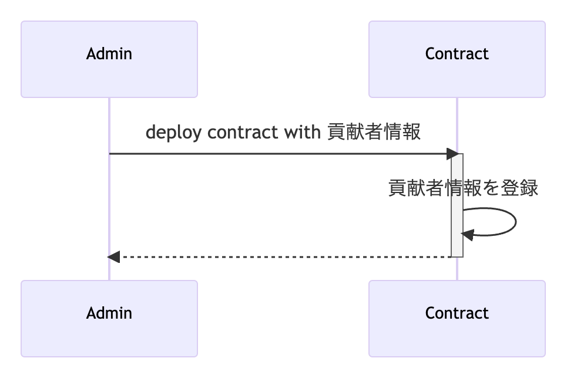
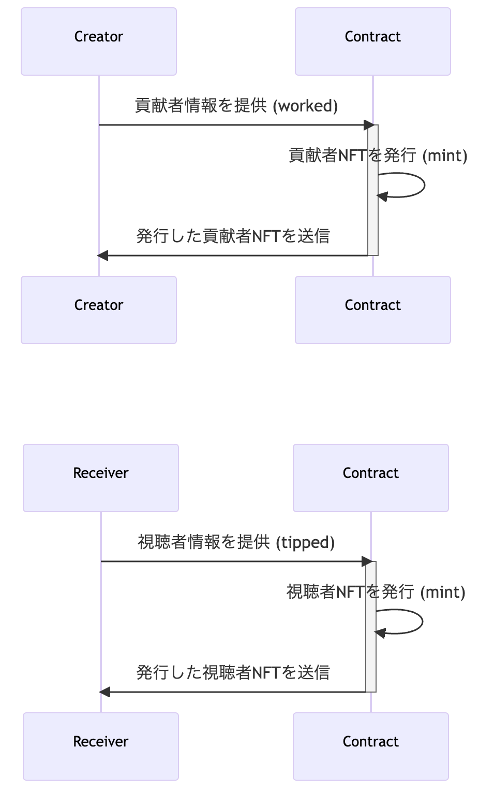
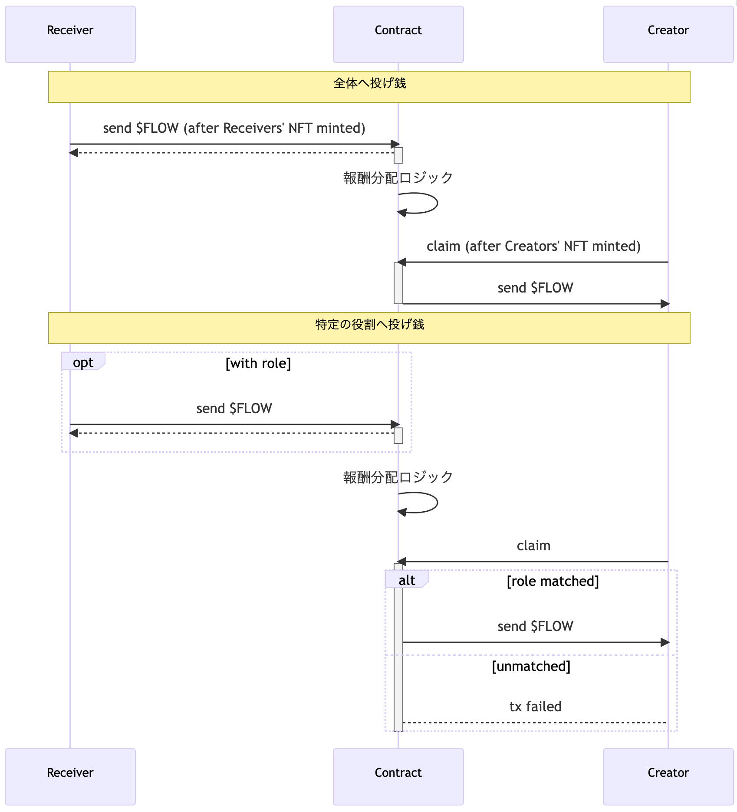

<!-- 
_color: white
_backgroundImage: '' 
-->
# Crediflow (draft)

hironow

---

# What is does - 目的

映画やアニメ、ゲームなどのコンテンツ業界における
公正な報酬システムの構築

---

# What is does - 目指すこと

* パブリックブロックチェーンのコントラクトや
エンドクレジットとしてのNFTを通じて
貢献者に直接的な報酬を提供することで
初期段階から報酬支払いの仕組みを可能にすること
* Flowブロックチェーン上に構築され
公正なエンドクレジットの作成や報酬分配方法の
柔軟な設計のインターフェイスを提供すること

---

# The problem it solves

映画やアニメ、ゲームなどのコンテンツ業界において
貢献者に公正な報酬を提供することを可能にする
直接的な報酬支払いの仕組みを構築する

⇓

公正な報酬の支払いが行われ
貢献者がサポーターからの報酬支払いを
受け取ることができるようになります

---

# Challenges I ran into

* 映画やアニメ、ゲームなどのコンテンツ業界における
役割の抽象化
* パブリックブロックチェーンのコントラクトを使用した
報酬分配の実現方法の抽象化
* ブロックチェーン技術を活用した
エンドクレジットNFTの実装方法の確立

---

# Other

Flowブロックチェーン上に
以下の各ステップを構築することで
手法を学びながら実装中

* Flowコントラクトの用意
* 貢献者の登録
* NFTの発行
* チップを送る（Tipを送る）

---
<!-- 
_color: white
_backgroundImage: '' 
-->

# 実装の想定シーケンス図

---
<!-- 
_footer: ''
backgroundColor: #fff
_backgroundImage: '' 
-->
#

---
<!-- 
_footer: ''
backgroundColor: #fff
_backgroundImage: '' 
-->
#

---
<!-- 
_footer: ''
backgroundColor: #fff
_backgroundImage: '' 
-->
#

---
<!-- 
_color: white
_backgroundColor: #00ef8b
_backgroundImage: '' 
-->
# 創りたい体験

---

# Side: Receiver

* 消費・熱狂した作品にチップした証の保持
* 貢献者 or 特定の貢献者たちに対してチップの送付
* 具体例:
  * マイナー作品Aに関わったジュニアクリエイターだけに対してチップを送付する
  * ※一般的な投げ銭よりもエンドクレジットを介することで作品を通すことで熱量を伝えるられるようにしたい

---

# Side: Creator

* 参加・貢献した作品の証の保持 (匿名も含む)
* 貢献者NFTを介してチップの受け取り
* 具体例:
  * ジュニア時代に参加した作品の熱心なファンからのチップをいつでもClaimでき、金銭的収益を得られる
  * ※Claimするまでは自己資産ではない扱いにしたい

---

# 実現したいことのイメージ

* クラウドファンディングとは違う。作品が完成した状態での体験としたい
* ふるさと納税のエンタメ版と言えるかもしれない
* 主役はCreatorであるが、Addressと個人情報を紐付けすぎたくはない
* 作品とそのエンドクレジット(コントラクト)を間におくことでDeFiのLPとStaking, Claimの概念的な実装をしたい
  * たとえば、LP供給者はReceiverであり、Claimできるのは特定のCreatorのみとなる
