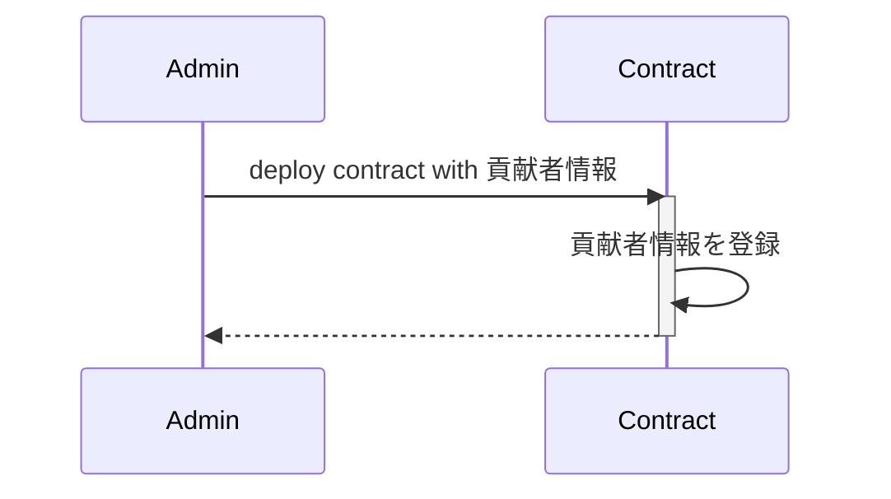
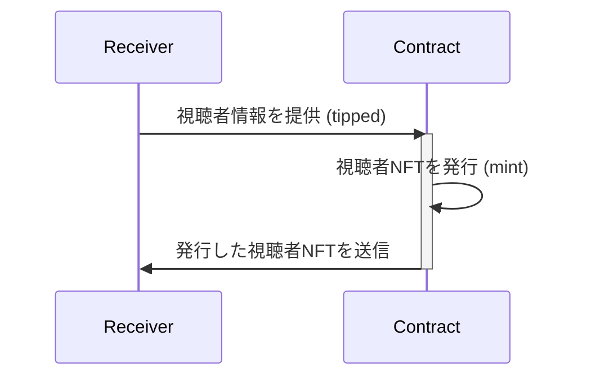
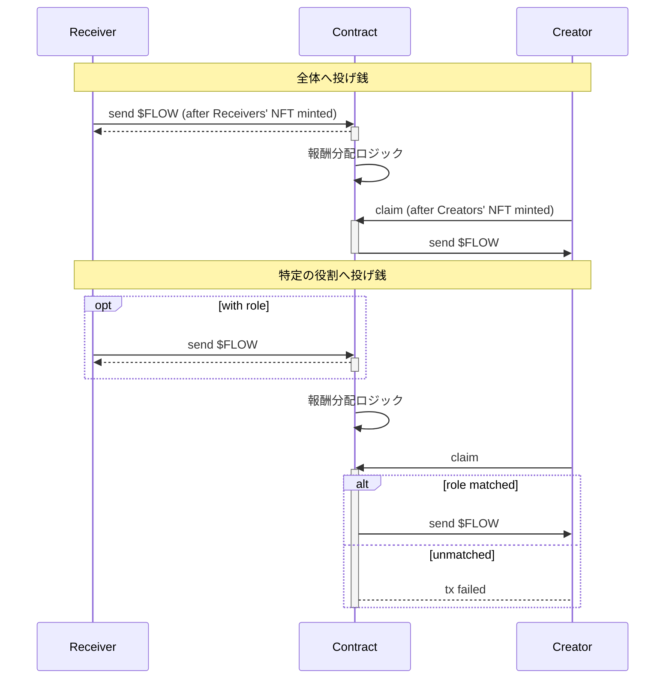

# シーケンス図

## 1. コントラクトの用意と2. 貢献者の登録

```mermaid
sequenceDiagram
    participant Admin
    participant Contract
    Admin->>Contract: deploy contract with 貢献者情報
    activate Contract
    Contract->>Contract: 貢献者情報を登録
    Contract-->>Admin: 
    deactivate Contract
```

## 3. NFTの発行

```mermaid
sequenceDiagram
    participant Creator
    participant Contract
    Creator->>Contract: 貢献者情報を提供 (worked)
    activate Contract
    Contract->>Contract: 貢献者NFTを発行 (mint)
    Contract->>Creator: 発行した貢献者NFTを送信
    deactivate Contract
```

```mermaid
sequenceDiagram
    participant Receiver
    participant Contract
    Receiver->>Contract: 視聴者情報を提供 (tipped)
    activate Contract
    Contract->>Contract: 視聴者NFTを発行 (mint)
    Contract->>Receiver: 発行した視聴者NFTを送信
    deactivate Contract
```

## 4. 投げ銭

```mermaid
sequenceDiagram
    participant Receiver
    participant Contract
    participant Creator

    Note over Receiver,Creator: 全体へ投げ銭
    Receiver->>Contract: send $FLOW (after Receivers' NFT minted)
    activate Contract
    Contract-->>Receiver: 
    deactivate Contract

    Contract->>Contract: 報酬分配ロジック

    Creator->>Contract: claim (after Creators' NFT minted)
    activate Contract
    Contract->>Creator: send $FLOW
    deactivate Contract


    Note over Receiver,Creator: 特定の役割へ投げ銭
    opt with role
        Receiver->>Contract: send $FLOW
    activate Contract
    Contract-->>Receiver: 
    deactivate Contract
    end

    Contract->>Contract: 報酬分配ロジック

    Creator->>Contract: claim
    activate Contract
    alt role matched
    Contract->>Creator: send $FLOW
    else unmatched
    Contract-->Creator: tx failed
    end
    deactivate Contract
```
