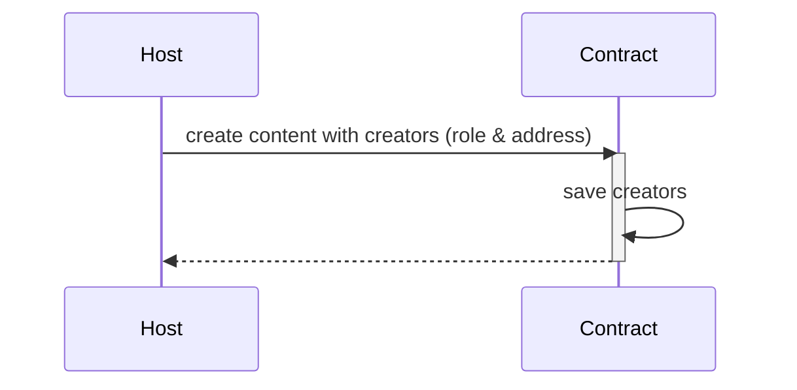
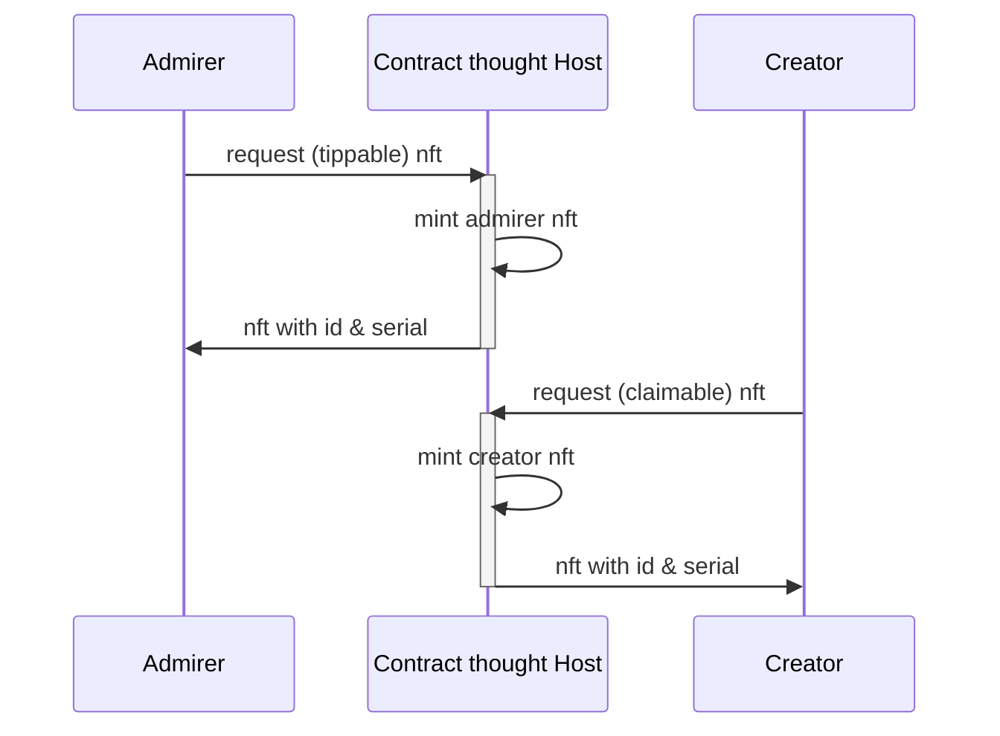
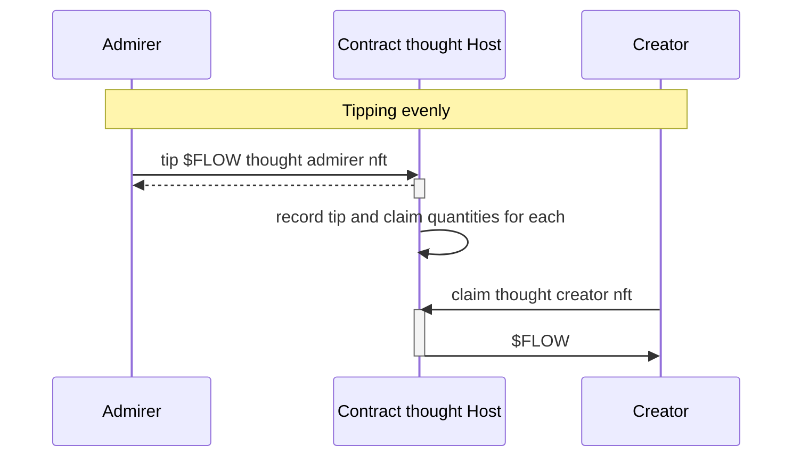

# Sequence

## Create Crediflow content

```mermaid
sequenceDiagram
    participant Host
    participant Contract
    Host->>Contract: create content with creators (role & address)
    activate Contract
    Contract->>Contract: save creators
    Contract-->>Host: 
    deactivate Contract
```

## Mint Crediflow NFT

```mermaid
sequenceDiagram
    participant Admirer
    participant Contract as Contract thought Host
    participant Creator

    Admirer->>Contract: request (tippable) nft
    activate Contract
    Contract->>Contract: mint admirer nft
    Contract->>Admirer: nft with id & serial
    deactivate Contract

    Creator->>Contract: request (claimable) nft
    activate Contract
    Contract->>Contract: mint creator nft
    Contract->>Creator: nft with id & serial
    deactivate Contract
```

## Tip & Claim thought NFT

```mermaid
sequenceDiagram
    participant Admirer
    participant Contract as Contract thought Host
    participant Creator

    Note over Admirer,Creator: Tipping evenly
    Admirer->>Contract: tip $FLOW thought admirer nft
    activate Contract
    Contract-->>Admirer: 
    deactivate Contract

    Contract->>Contract: record tip and claim quantities for each

    Creator->>Contract: claim thought creator nft
    activate Contract
    Contract->>Creator: $FLOW
    deactivate Contract
```
